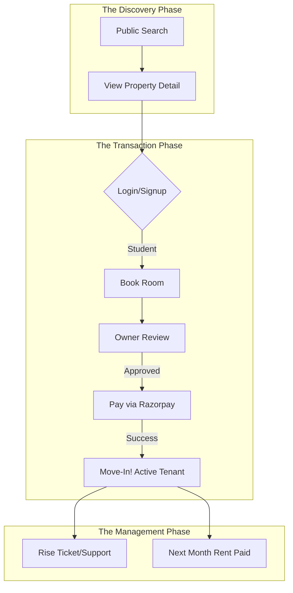
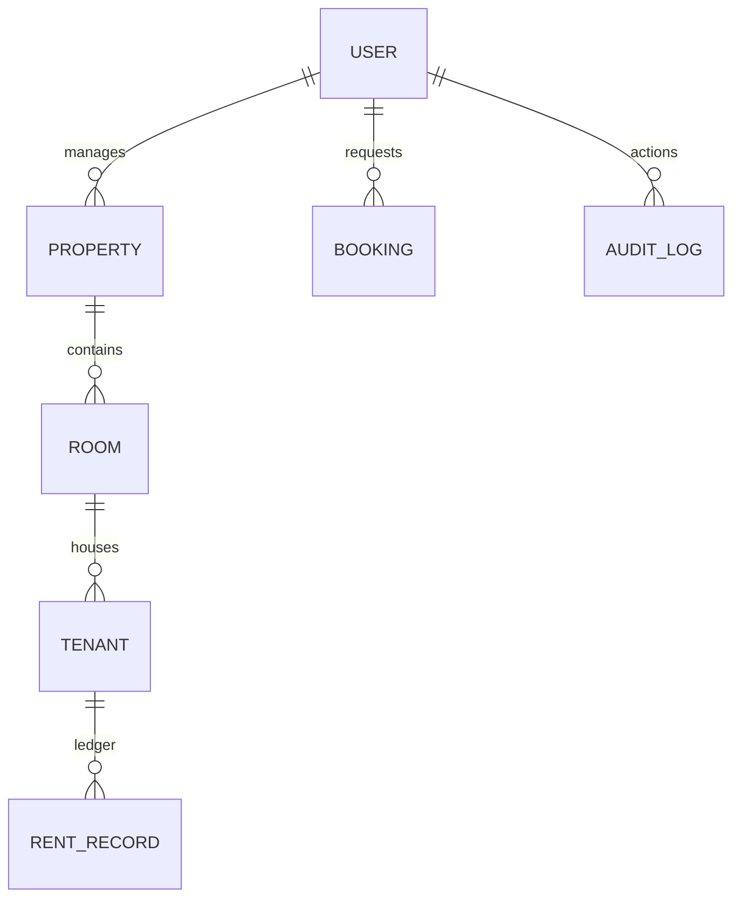

# 🚀 RentPe: The Complete Business & Technical Blueprint

This document is the master file for the **RentPe** project. It combines the business vision with the technical implementation details required to launch a production-ready rental management platform.

---

## 🌟 1. Business Project Idea: The Vision

### **The Problem**
In many emerging markets and education hubs (like Delhi North Campus), the PG (Paying Guest) and rental market is highly fragmented. 
- **Students** struggle with fragmented information, hidden charges, and manual payment tracking.
- **Owners** are overwhelmed by Excel sheets, manual rent collection, staff management, and tracking maintenance issues across multiple properties.

### **The Solution: RentPe**
RentPe is a "Prop-Tech" (Property Technology) ecosystem that digitizes the entire living experience. It isn't just a listing site; it's an **Operating System for PGs**.

### **Market Analysis**
- **Target Audience:** College students, young working professionals, and small-to-medium PG owners.
- **Unique Selling Point (USP):** A three-tier dashboard (Admin, Owner, Student) that ensures 100% transparency in payments and operation, with a "Premium-First" user experience.

### **Monetization Strategy (How it makes money)**
1.  **Subscription Model (SaaS):** Charge PG owners a monthly fee per bed/room managed.
2.  **Transaction Fees:** A small convenience fee on digital rent payments processed through the platform.
3.  **Premium Listings:** Charge owners for "Featured" placement in search results.
4.  **Value-Added Services:** Commissions on laundry, meal plans, or maintenance services booked through the app.

---

## 🏗️ 2. Product Requirements Document (PRD)

### **Core Modules**
1.  **User Auth & Role Management:** Secure login for 3 distinct roles with guarded access.
2.  **Property Management:** Owner-facing tools to manage rooms, occupancy, and pricing.
3.  **Booking Workflow:** Digital requests, owner approvals, and instant payment links.
4.  **Tenant Ledger:** Automated rent history, "Mark Paid" status, and vacating timestamps.
5.  **Staff & Team Delegation:** Ability for Admins to hire "Mods" and Owners to hire "Managers" with specific permissions.
6.  **Audit Trail:** Every ban, payment, and room change is logged for security.

---

## 🛠️ 3. Technical Stack (The "Engine")

| Layer | Technology | Rationale |
| :--- | :--- | :--- |
| **Frontend** | **Next.js 16 + React 19** | Industry standard for SEO and high-performance web apps. |
| **Styling** | **Tailwind CSS** | Highly customizable, ensures a premium "glassmorphism" look. |
| **Database** | **SQLite + Prisma 7** | Lightweight, robust, and handles complex relations with ease. |
| **Security** | **JWT + Bcrypt.js** | Industry-standard encryption for user data and sessions. |
| **Payments** | **Razorpay** | The most trusted payment gateway in India for rent/UPI. |

---

## 🔄 4. System & User Flow

---

## 📊 5. Database Schema Architecture

---

## 🎨 6. Visual Mockups

Below are the initial design mockups for the RentPe ecosystem. These illustrate the premium "glassmorphism" aesthetic we are implementing.

### **Owner Dashboard Mockup**

### **Administrator Overview Mockup**

---

## 🚀 7. Implementation Plan (Roadmap to Launch)

### **Phase 1: The Foundation (Current)**
- **Database:** SQLite setup with all schemas (Users, Rooms, Tenants).
- **Mock Data:** Initial seeding of admin/owner accounts.

### **Phase 2: Security & Identity**
- **Auth:** Switch from "Demo Redirects" to real JWT tokens.
- **Middleware:** Block students from seeing the Admin panel.

### **Phase 3: Operational APIs**
- **Data Hookup:** Replace all `localStorage` calls with real API calls to the Database.
- **Real-Time Logs:** Finalize the Audit Log system.

### **Phase 4: Financial Integration**
- **Payments:** Link the "Pay Now" button to Razorpay Test Mode.
- **Invoicing:** Automatic receipt generation after a payment is verified.

### **Phase 5: Go-Live**
- **Hosting:** Deploy on Vercel.
- **Domain:** connect `rentpe.in` or similar domain.

---

## 📥 7. How to "Download" this documentation

Since this file is generated in your project workspace:
1.  **Direct Access:** Open the file `rentpe_complete_business_blueprint.md` in your code editor.
2.  **Download:** You can simply **Copy** the content and paste it into a Word Doc, or use a "Markdown to PDF" tool if you want a formal PDF.
3.  **Local Path:** `c:\Antigravity\ANTIGRATIVITY project\rentpe\rentpe_complete_business_blueprint.md`

---
*Created by Antigravity AI for the RentPe Project.*
